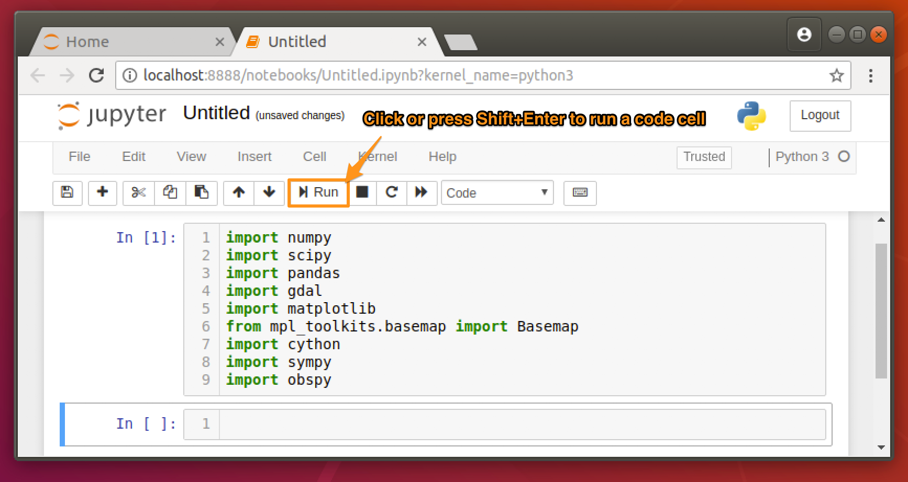

<div
    style='background-image: url("images/_banner_.jpg"); padding: 0px;
    background-size: cover; border-radius: 10px; height: 250px;
    background-position: 50% 50%'>
    <div
        style="float: left; margin: 20px; padding: 10px;
        background: rgba(255 , 255 , 255 , 0.8); width: 40%; height: 100px;
        border-radius: 10px">
        <div
            style="position: relative; top: 50%;
            transform: translatey(-50%)">
            <div
                style="font-size: xx-large; font-weight: 900;
                color: rgba(0 , 0 , 0 , 0.9);
                line-height: 100%">Python Workshop
            </div>
            <div
                style="font-size: large; padding-top: 20px;
                color: rgba(0 , 0 , 0 , 0.7)">Getting ready
            </div>
        </div>
    </div>
    <div style="float: right; font-size: small;
        position: relative; top: 90%; padding: 5px;
        background: rgba(255 , 255 , 255 , 0.6); border-top-left-radius: 10px;
        color: rgba(0 , 0 , 0 , 1)">Shahar Shani-Kadmiel, CiTG, TU Delft
    </div>
</div>

Welcome everyone to our introductory Python workshop. As we stated in the initial email, the purpose of this workshop is to help you dive into Python and do basic (or not so basic) data visualization, reading and writing files, prototyping processing workflows into reusable tools and more.

# The dry details:

- **When:** Friday 27 July 2018; 09:30 - 16:30
- **Where:** CiTG KG 02.110

---
# Preparations

We would like to jump directly into the workshop itself and not deal with support related issues on that day so please follow these steps prior to attending the workshop to get a functional python environment on your laptop.

If you have a working python environment you can skip the next step and go directly to step [#2](#2.-Install-packages) but please follow step [#3](#3.-Test-your-environment) to test your environment.

## 1. Download [Miniconda](https://conda.io/miniconda.html):

[Miniconda](https://conda.io/miniconda.html) is a mini version of [Anaconda](https://www.anaconda.com/) that includes only **`conda`** and its dependencies. Follow the installation instruction ([Linux](https://conda.io/docs/user-guide/install/linux.html#installing-on-linux), [OSX or macOS](https://conda.io/docs/user-guide/install/macos.html#installing-on-macos)) to get started on your system.

In short, this will include:

1. Downloading the `Miniconda3-latest-*-x86_64.sh`, where `*` will be either `MacOSX` or `Linux`.
2. Installing miniconda by firing up the Terminal and typing:
```bash
cd Downloads/
bash Miniconda3-latest-*-x86_64.sh
```
3. Agreeing to the *license terms* (type `yes`)
4. Accept the default install location proposed by the installer (press *Enter*)
5. Allow Miniconda to prepend the install location to the PATH (type `yes`)

---
## 2. Install packages

Restart your Terminal so that the new entry to your PATH takes effect. You should now be able to type `conda` in the Terminal command prompt and see the conda help message.

Conda is a smart tool for package, dependency and environment management for many languages. You can read more about it [here](https://conda.io/docs/index.html), ***but you don't have to***.

To install the packages we need for the workshop copy and paste the following into the Terminal:

```bash
conda config --add channels conda-forge && conda install -y ipython notebook ipywidgets numpy scipy pandas gdal matplotlib basemap basemap-data-hires cython sympy obspy
```

This may take a couple of minuets and will result is many other packages getting installed as *conda* takes care of package dependencies for you.

---
## 3. Test your environment

To make sure you are *good-to-go*, type `jupyter-notebook` in the Terminal. A browser window should open and you should be able to start a new Python 3 Notebook.


Copy the following `import` commands to the code cell in the newly opened notebook session:

```python
import numpy
import scipy
import pandas
import gdal
import matplotlib
from mpl_toolkits.basemap import Basemap
import cython
import sympy
import obspy
import ipywidgets
```



Execute the code in the cell by pressing <kbd>Shift</kbd> + <kbd>Enter</kbd> (<kbd>⇧↩</kbd>) or clicking the <button class="btn btn-default" title="Run" style="padding: 1px 5px"><i class="fa-step-forward fa"></i><span class="toolbar-btn-label">Run</span></button> button.

It is alright if you get some warnings but if you get an error message please come see me so we can solve this before the workshop. If a new code cell is created like in the above screenshot you are *good-to-go*.

---
## This is it. See you at the workshop...
